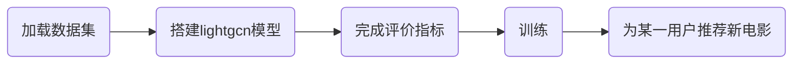
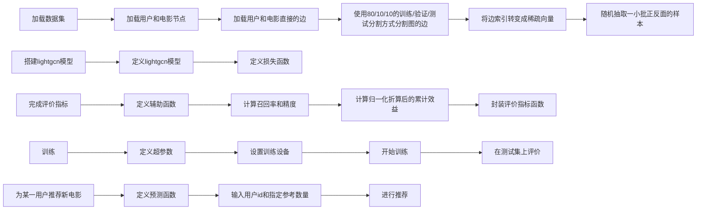

# Meta-Learning Based Knowledge Extrapolation for Knowledge Graphs in the Federated Setting
> https://www.ijcai.org/proceedings/2022/0273.pdf?spm=wolai.workspace.0.0.42c7327fCS977S&file=0273.pdf

一个基于嵌入的模型，训练了可见的关系和实体，并将联邦设置中的KGs推广到不可见的关系和实体

# GNN/GCN论文精读

这篇文章分为四个部分解释现代gnn:

1. 什么数据可以表示一张图
2. 图跟别的数据有什么不一样的地方
3. 构建一个gnn，看各个模块什么样子
4. 搭建了一个playground

图包括顶点、边，也就是实体和关系。顶点和边都能用embedding向量来表示。

重点：信息——》向量。

文本表示图就是文本序列用有向边依次连接每个词。还有社交图，知识图，引用图。社交图就比如跆拳道比赛，人看作顶点，比赛看作边。知识图就是wiki中的索引看着知识。引用图就是每篇论文中引用了其他哪些文章。

任务：节点分类，边预测，整图识别

图的四个属性：顶点、边、全局信息以及连接性。

gnn是一个对图所有的属性的优化转换，这个转换是可以保存图的对称信息的。

gnn的假设：保持图的对此性，类似于卷积假设空间不变换性，循环假设时序的延续性

图卷积和矩阵乘法

## 1.  图卷积网络（Graph Convolutional Networks）

> [如何理解GCN](https://www.zhihu.com/question/54504471/answer/332657604)

CNN无法处理非结构化的数据（拓扑图），又希望在拓扑图上有效的提取空间特征来进行机器学习，所以GCN成了研究重点。**广义上来讲任何数据在赋范空间内都可以建立拓扑关联，谱聚类就是应用了这样的思想**。**所以说拓扑连接是一种广义的数据结构，GCN有很大的应用空间。**GCN是要为除CV、NLP之外的任务提供一种处理、研究的模型。

GCN的本质目的：提取拓扑图的空间特征。两种方式：空间维度Vertex domain(spatial domain)、图谱维度**Spectral domain**。

- 空间维度效果可能没有卷积好；计算处理必须针对每个点。
- 图谱维度：GCN的理论基础。希望借助图谱的理论来实现拓扑图上的卷积操作。从整个研究的时间进程来看：首先研究GSP（graph signal processing）的学者定义了graph上的Fourier Transformation，进而定义了graph上的Convolution，最后与深度学习结合提出了Graph Convolutional Network。**借助于图的拉普拉斯矩阵的特征值和特征向量来研究图的性质。**

###  1.1 拉普拉斯矩阵

1. 常用的拉普拉斯矩阵有三种：

2. GCN用拉普拉斯矩阵的原因：

- 拉普拉斯矩阵是对称矩阵，可以进行特征分解，与GCN的spectral domain对应上了。
- 拉普拉斯矩阵只在中心顶点和一阶相连的顶点上（1-hop neighbor）有非0元素，其余之处均为0

3. **矩阵的谱分解，特征分解，对角化都是同一个概念**

​	  **不是所有的矩阵都可以特征分解**，其充要条件为n阶方阵存在n个[线性无关](https://link.zhihu.com/?target=https%3A//www.baidu.com/s%3Fwd%3D%E7%BA%BF%E6%80%A7%E6%97%A0%E5%85%B3%26tn%3D44039180_cpr%26fenlei%3Dmv6quAkxTZn0IZRqIHckPjm4nH00T1d9mW64Phf3mhD1ujubn1cz0ZwV5Hcvrjm3rH6sPfKWUMw85HfYnjn4nH6sgvPsT6KdThsqpZwYTjCEQLGCpyw9Uz4Bmy-bIi4WUvYETgN-TLwGUv3EnHT3PjD4njnsP1RdPWfkP1mY)的[特征向量](https://link.zhihu.com/?target=https%3A//www.baidu.com/s%3Fwd%3D%E7%89%B9%E5%BE%81%E5%90%91%E9%87%8F%26tn%3D44039180_cpr%26fenlei%3Dmv6quAkxTZn0IZRqIHckPjm4nH00T1d9mW64Phf3mhD1ujubn1cz0ZwV5Hcvrjm3rH6sPfKWUMw85HfYnjn4nH6sgvPsT6KdThsqpZwYTjCEQLGCpyw9Uz4Bmy-bIi4WUvYETgN-TLwGUv3EnHT3PjD4njnsP1RdPWfkP1mY)。

​	  **但是拉普拉斯矩阵是半正定对称矩阵**（半正定矩阵本身就是对称矩阵），有如下三个性质：

- 实对称矩阵一定n个线性无关的特征向量
- 半正定矩阵的特征值一定非负
- 实对阵矩阵的特征向量总是可以化成两两相互正交的正交矩阵

4. **把传统的傅里叶变换以及卷积迁移到Graph上来，核心工作其实就是把拉普拉斯算子的特征函数$\ e^{-i \omega t}$变为Graph对应的拉普拉斯矩阵的特征向量**

5. 为什么拉普拉斯矩阵的特征向量可以作为傅里叶变换的基？

   傅里叶变换一个本质理解就是：**把任意一个函数表示成了若干个正交函数的线性组合**

###  1.2 深度学习中的图卷积

**Deep learning 中的Convolution就是要设计含有trainable共享参数的kernel**

**CNN中有两大核心思想：网络局部连接，卷积核参数共享。**

深度学习中最重要的是学习特征：随着网络层数的增加，特征越来越抽象，然后用于最终的任务。

将学习分成三个部分：

- 变换（transform）：对当前的节点特征进行变换学习，这里就是乘法规则（Wx）；

- 聚合（aggregate）：聚合领域节点的特征，得到该节点的新特征，这里是简单的加法规则；

- 激活（activate）：采用激活函数，增加非线性。

  首先这里的权重是所有节点共享的，类比于CNN中的参数共享；另外可以将节点的邻居节点看成感受野，随着网络层数的增加，感受野越来越大，即节点的特征融合了更多节点的信息。

###  1.3 lightgcn

流程图：

请把下面的逻辑描述，转成mermaid语法代码，用来生成流程图。

1. 加载数据集。

   - 下载数据集

   - 加载用户和电影节点

   - 加载用户和电影直接的边（关系）

   - 使用80/10/10的训练/验证/测试分割方式分割图的边

   - 将边索引转变成稀疏向量

   - 随机抽取一小批正负的样本

     - 负抽样的目的是为了最终输出的上下文单词（正样本），在采样过程中应该保留下来并更新，同时也需要采集部分负样本（非上下文单词）。通过负采样，在更新隐层到输出层的权重时，只需更负采样的单词，而不用更新词汇表所有单词，**节省计算量**。

     - 为什么要进行采样？

       知识图谱只包含观察者事实(正三元组样例)，未观测到的事实是被分为负例的概率很大。

2. 搭建lightgcn模型

   - 定义lightgcn模型
     - 定义light 图卷积层，根据对user-item的embedding传播规则实现
     - Layer Combination and Model Prediction。LightGCN的唯一可训练参数是对每个user和item的第0层嵌入$\ e_u^{(0)}$和$ e_i^{(0)}$。
     - 定义矩阵xing'shi
     
   - 定义损失函数

     BPR（贝叶斯个性化排名）损失函数

3. 完成评价指标

   - 定义辅助函数
   - 计算召回率和精度
   - 计算归一化折算后的累计效益
   - 封装评价指标函数

4. 训练

   - 定义超参数
   - 设置训练设备
   - 开始训练
   - 在测试集上评价

5. 为某一用户推荐新电影

   - 定义预测函数
   - 输入用户id和指定参考数量
   - 进行推荐

GCN的缺点也是很显然易见的，**第一，GCN需要将整个图放到内存和显存，这将非常耗内存和显存，处理不了大图**；**第二，GCN在训练时需要知道整个图的结构信息**(包括待预测的节点), 这在现实某些任务中也不能实现(比如用今天训练的图模型预测明天的数据，那么明天的节点是拿不到的)。

##  2. Graph Sample and Aggregate(GraphSAGE)

> 为了解决GCN的两个缺点问题，GraphSAGE被提了出来。
>
> Inductive learning:归纳学习
> Transductive learning:转换学习
>
> 图数据中的每一个节点可以通过边的关系利用其他节点的信息。这就导致一个问题，GCN输入了整个图，训练节点收集邻居节点信息的时候，用到了测试和验证集的样本，我们把这个称为Transductive learning。
>
> 然而，我们所处理的大多数的机器学习问题都是Inductive learning，因为我们刻意的将样本集分为训练/验证/测试，并且训练的时候只用训练样本。
>
> 这样对图来说有个好处，可以处理图中新来的节点，可以利用已知节点的信息为未知节点生成embedding，GraphSAGE就是这么干的。

GraphSAGE是一个Inductive Learning框架，具体实现中，训练时它仅仅保留训练样本到训练样本的边，然后包含Sample和Aggregate两大步骤，Sample是指如何对邻居的个数进行采样，Aggregate是指拿到邻居节点的embedding之后如何汇聚这些embedding以更新自己的embedding信息。

​																								图1

上图展示了graphSAGE学习的一个过程。

1. 对邻居采样
2. 采样后的邻居embedding传到节点上来，并使用一个聚合函数聚合这些邻居信息以更新节点的embedding
3. 根据更新后的embedding预测节点的标签

​																								图2

接下来，详细的说明一个训练好的GrpahSAGE是如何给一个新的节点生成embedding的（即一个前向传播的过程），如上图。

> 首先，(line1)算法首先初始化输入的图中所有节点的特征向量，(line3)对于每个节点 $ v$ ，拿到它采样后的邻居节点 $ N(v)$ 后，(line4)利用聚合函数聚合邻居节点的信息，(line5)并结合自身embedding通过一个非线性变换更新自身的embedding表示。

注意到算法里面的$ 	K$ ，它是指聚合器的数量，也是指权重矩阵的数量，还是网络的层数，这是因为**每一层网络中聚合器和权重矩阵是共享的**。网络的层数可以理解为需要最大访问的邻居的跳数(hops)，比如在图1中，红色节点的更新拿到了它一、二跳邻居的信息，那么网络层数就是2。为了更新红色节点，首先在第一层(k=1)，我们会将蓝色节点的信息聚合到红色解节点上，将绿色节点的信息聚合到蓝色节点上。在第二层(k=2)红色节点的embedding被再次更新，不过这次用到的是更新后的蓝色节点embedding，这样就保证了红色节点更新后的embedding包括蓝色和绿色节点的信息，也就是两跳信息。

GraphSAGE中的采样（sample）：采用定长抽样的方法，具体来说，定义需要的邻居个数 $ S $ ，然后采用有放回的重采样/负采样方法达到 $ S$。保证每个节点（采样后的）邻居个数一致，这样是为了把多个节点以及它们的邻居拼接成Tensor送到GPU中进行批训练。

GraphSAGE中的聚合器：Mean Aggregator、LSTM Aggregator、Pooling Aggregator。Mean Aggregator和GCN的做法基本是一致的（GCN实际上是求和）。

<u>GraphSAGE是如何学习聚合器的参数以及权重矩阵 $ W$呢？</u>如果是**有监督**的情况下，可以使用每个节点的预测lable和真实lable的交叉熵作为损失函数。如果是在**无监督**的情况下，可以假设相邻的节点的embedding表示尽可能相近。

**GraphSAGE的优点**：

1. 利用采样机制，很好的解决了GCN必须要知道全部图的信息问题，克服了GCN训练时内存和显存的限制，即使对于未知的新节点，也能得到其表示
2. 聚合器和权重矩阵的参数对于所有的节点是共享的
3. 模型的参数的数量与图的节点个数无关，这使得GraphSAGE能够处理更大的图
4. 既能处理有监督任务也能处理无监督任务

GraphSAGE的缺点：每个节点那么多邻居，GraphSAGE的采样没有考虑到不同邻居节点的重要性不同，而且聚合计算的时候邻居节点的重要性和当前节点也是不同的。

##  3. 图注意力网络（Graph Attention Networks）

> 注意力机制如今已经被广泛地应用到了基于序列的任务中，它的优点是能够放大数据中最重要的部分的影响。这个特性已经被证明对许多任务有用，例如机器翻译和自然语言理解。如今融入注意力机制的模型数量正在持续增加，图神经网络也受益于此，它在聚合过程中使用注意力，整合多个模型的输出，并生成面向重要目标的随机行走。在本节中，我们将讨论注意力机制如何在图结构数据中使用。
>
> 为了解决GNN聚合邻居节点的时候没有考虑到不同的邻居节点重要性不同的问题，GAT借鉴了Transformer的idea，引入masked self-attention机制，在计算图中的每个节点的表示的时候，会根据邻居节点特征的不同来为其分配不同的权值。

图注意力网络（GAT）是一种基于空间的图卷积网络，它的注意机制是在聚合特征信息时，将注意机制用于确定节点邻域的权重。
注意力函数自适应地控制相邻节点j对节点i的贡献。并且可以使用多头注意力。

无论是在Transductive Learning还是在Inductive Learning的任务上，GAT的效果都要优于传统方法的结果。

至此，GAT的介绍完毕，我们来总结一下，GAT的一些优点，

（1）训练GCN无需了解整个图结构，只需知道每个节点的邻居节点即可

（2）计算速度快，可以在不同的节点上进行并行计算

（3）既可以用于Transductive Learning，又可以用于Inductive Learning，可以对未见过的图结构进行处理
